# Smart Home

[](https://www.python.org/downloads/)
[](https://flask.palletsprojects.com/)
[](LICENSE)

Smart Home is a modular and extensible open-source platform for home automation. It provides an intuitive and user-friendly web interface to control and monitor various smart devices in your home.

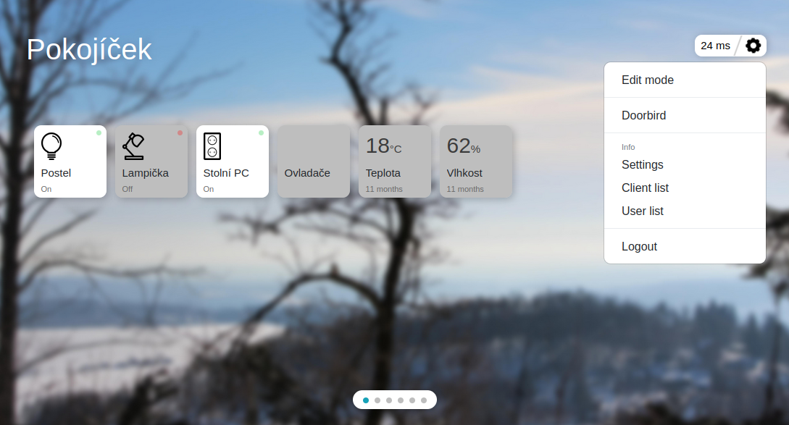

## Features

- **Intuitive Dashboard**: A clean and modern web interface for managing your smart home devices.
- **Modular and Extensible**: Easily add new devices, protocols, and UI components (Tiles and Items).
- **User Management**: A robust user management system with roles and permissions (Owner, Administrator, Manager, Visitor).
- **Real-time Communication**: Uses Flask-SocketIO for real-time updates between the server and clients.
- **Persistence**: Everything is immediately persisted (currently opened modal, changes in configuration, ...)
- **Customizable UI**:
    - **Themes**: Light, Dark, and Smart (auto-switches based on sunrise/sunset) themes.
    - **Backgrounds**: Choose from a variety of light, dark, or random backgrounds, or set a static one. The application automatically compresses and blurs background images for a better user experience.
    - **Layout**: Organize your devices into "Slides" (pages) and "Tiles" (widgets).
- **Protocols**: Supports various protocols for device communication:
    - **MQTT**: For lightweight IoT device communication.
    - **Magic Packet**: To wake up devices on your network.
    - **RTSP**: For streaming video from cameras.
    - **Prusa**: To monitor Prusa 3D printers.
    - **Alarm**: For time-based automation.
- **Security**:
    - **Authentication**: Secure login and registration system.
    - **Blacklist/Whitelist**: Restrict access to the dashboard based on MAC addresses.
    - **Input Validation**: Protects against common web vulnerabilities like XSS, Path Traversal, and SQL Injection.
- **Android App**: A native Android application for a seamless mobile experience, with the ability to control phone features like the flashlight and volume via MQTT.
- **Pre-loader**: A loading screen is displayed while the application is loading to prevent a jarring user experience.
- **Terminal UI**: A graphical terminal UI for debugging purposes.

## Tech Stack

### Backend

- **Python**: The core programming language.
- **Flask**: A lightweight web framework for the backend.
- **Flask-SocketIO**: For real-time communication.
- **Flask-Login**: For user authentication.
- **SQLAlchemy**: For database interactions.
- **Jinja2**: A templating engine for rendering dynamic HTML.

### Frontend

- **HTML5, CSS3, JavaScript**: The building blocks of the web interface.
- **jQuery**: For simplifying DOM manipulation and event handling.
- **Bootstrap**: For responsive design and UI components.
- **Swiper.js**: For creating swipeable "Slides".
- **Sortable.js**: For drag-and-drop functionality.
- **Chart.js**: For creating interactive charts.

## Getting Started

### Prerequisites

- Python 3.9+
- `pip` for installing Python packages.

### Installation

1.  **Clone the repository:**

    ```bash
    git clone https://github.com/TadeasFrycak/smart-home.git
    cd smart-home
    ```

2.  **Create and activate a virtual environment:**

    ```bash
    python3 -m venv venv
    source venv/bin/activate
    ```

3.  **Run the script to install dependencies and run the app**

    ```bash
    python3 run.py
    ```

### Running the Application

To start the application, simply run the `run.py` script:

```bash
python3 run.py
```

The application will be accessible at `http://0.0.0.0:5000` by default.

After running the script, you will see a terminal output like this:
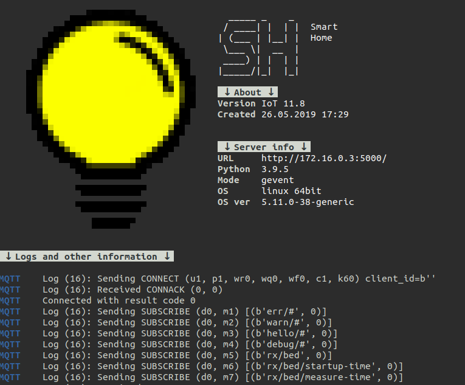

## Project Structure

The project is organized into the following directories:

-   **`config/`**: Contains all configuration files for the application, items, protocols and tiles.
-   **`data/`**: Contains the application's data, such as the database and device information.
-   **`docs/`**: Contains documentation and images for the project.
-   **`library/`**: Contains custom Python modules used throughout the application.
-   **`static/`**: Contains static assets such as CSS, JavaScript, and images.
-   **`templates/`**: Contains HTML templates for the web interface.
-   **`translations/`**: Contains translation files for supporting multiple languages.

## Configuration

The application's configuration is located in the `config/` directory.

### `main.ini`

Main application settings, such as database configuration, API keys, and other global settings.

```ini
[default]
registrations = true

[position]
latitude = 49.70
longitude = 17.08

[logs]
auth_priority = 1
terminal_priority = 1
changes_priority = 1
changes_edit_priority = 1
log_only = false
```

-   **registrations**: (true/false) Enable or disable user registrations.
-   **latitude/longitude**: Your location for accurate sunrise/sunset times (used for the "Smart" theme).
-   **auth\_priority, terminal\_priority, changes\_priority, changes\_edit\_priority**: Logging levels for different parts of the application.
-   **log\_only**: (true/false) If true, the terminal UI will not be displayed, and all output will be directed to log files.

### `flask.py`

This file contains Flask-specific configuration. For example:

```python
class DevelopmentConfig(Config):
    DEBUG = True
    SECRET_KEY = "123"
    HOST = "0.0.0.0"
    PORT = 5000
```

- **DEBUG**: (True/False) Enables or disables debug mode.
- **SECRET_KEY**: A secret key for signing session cookies.
- **HOST**: The host interface to bind to.
- **PORT**: The port to listen on.

### `blacklist.ini` and `whitelist.ini`

These files are used to control access to the application based on MAC addresses.

**`blacklist.ini`**
```ini
[blacklist]
aa:bb:cc:dd:ee:ff
```

**`whitelist.ini`**
```ini
[whitelist]
11:22:33:44:55:66
```

### `config/items/`, `config/protocols/`, `config/tiles/`

These directories contain configuration files for each type of item, protocol, and tile. More on that later.


## Multilanguage Support

The application supports multiple languages using Flask-Babel. The supported languages are automatically detected from the user's browser settings.

Currently supported languages:
-   English
-   Czech

### Adding or Editing Translations

1.  **Mark strings for translation:**

    In Python files, use `gettext()` or `_()`:
    ```python
    from flask_babel import gettext as _
    my_string = _("This is a translatable string.")
    ```

    In Jinja2 templates, use `_()`:
    ```html
    <p>{{ _("This is a translatable string.") }}</p>
    ```

2.  **Extract strings:**

    Run the following command to extract all marked strings into a `.pot` file:
    ```bash
    pybabel extract -F config/babel.ini -o messages.pot .
    ```

3.  **Create or update translation files:**

    To add a new language, run:
    ```bash
    pybabel init -i messages.pot -d translations -l <language_code>
    ```
    (e.g., `pybabel init -i messages.pot -d translations -l es` for Spanish)

    To update existing translations, run:
    ```bash
    pybabel update -i messages.pot -d translations
    ```

4.  **Translate the strings:**

    Edit the `.po` file for the desired language in the `translations` directory (e.g., `translations/es/LC_MESSAGES/messages.po`).

5.  **Compile the translations:**

    ```bash
    pybabel compile -d translations
    ```

## Components

This section provides a detailed overview of all available Tiles, Items, and Protocols.

### Tiles

Tiles are the main widgets on the dashboard.

| Image                               | Name          | Description                                                                                                |
| ----------------------------------- | ------------- | ---------------------------------------------------------------------------------------------------------- |
| 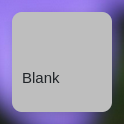            | Blank         | A blank tile that can contain items in its modal.                                                          |
| 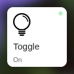       | Toggle        | A tile that can be toggled on or off, like a switch.                                                       |
| 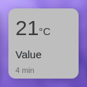            | Value         | Displays a single value with a unit.                                                                       |
| 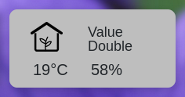 | Value Double  | Displays two values with units.                                                                            |
| 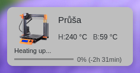            | Prusa         | Displays the status of a Prusa 3D printer.                                                                 |
| 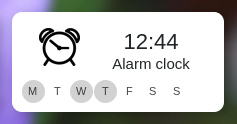      | Alarm Clock   | Triggers an event at a specific time and day.                                                              |
| 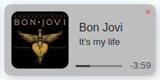          | Player        | A media player tile (currently under development).                                                         |

### Items

Items are the controls and information displayed within a tile's modal.

| Image                                       | Name            | Description                                                                      |
| ------------------------------------------- | --------------- | -------------------------------------------------------------------------------- |
| 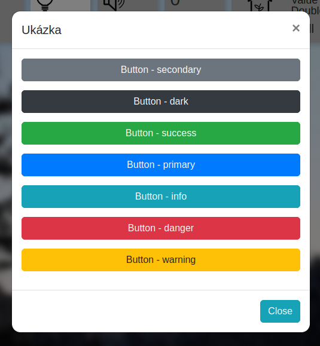             | Button          | A simple button that sends a predefined value when clicked.                      |
| 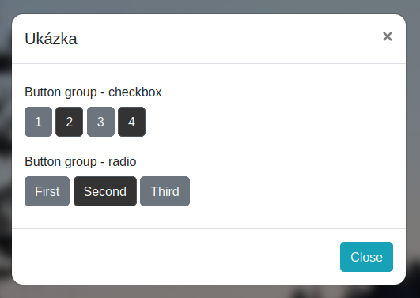 | Button Group    | A group of radio buttons or checkboxes.                                          |
| 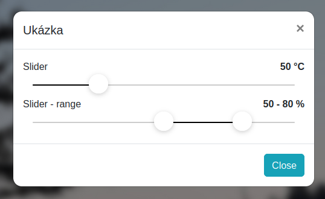             | Slider          | A slider for selecting a value or a range of values.                             |
| 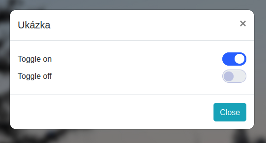             | Toggle          | A switch that can be toggled between two states.                                 |
| 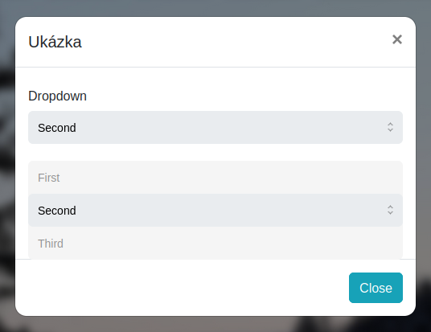         | Dropdown        | A dropdown menu for selecting one of several options.                            |
| 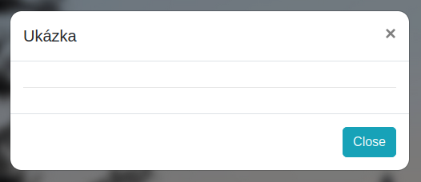       | Separator       | A visual separator to organize items in a modal.                                 |
| 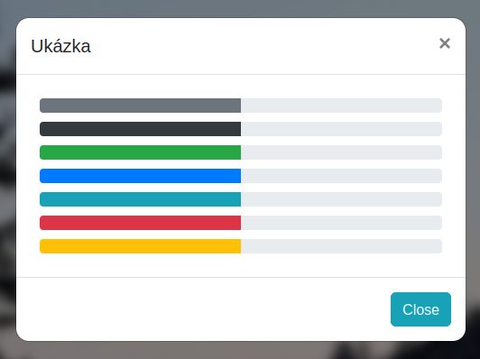 | Progress Bar    | A progress bar to visualize a value between a minimum and maximum.               |
| 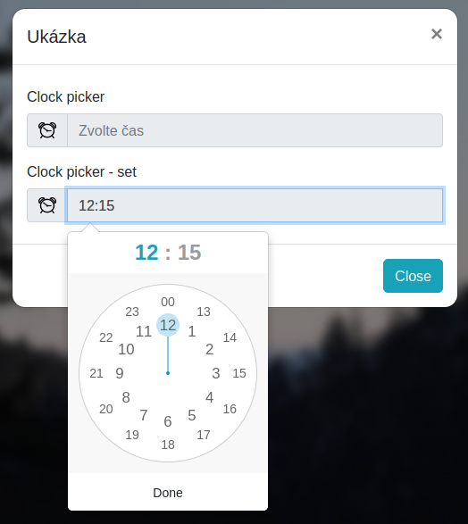   | Clock Picker    | A time picker for selecting a time.                                              |
| 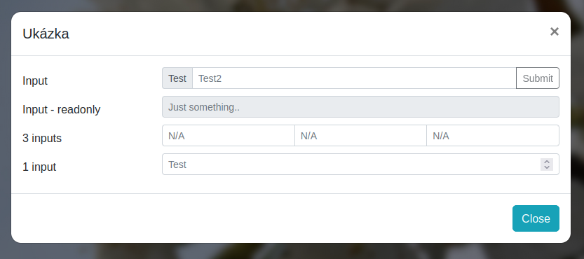               | Input           | A text input field for entering string or numeric values.                        |

### Protocols

Protocols define how the Smart Home application communicates with devices.

| Image                                             | Name          | Description                                                                                                |
| --------------------------------------------------- | ------------- | ---------------------------------------------------------------------------------------------------------- |
| 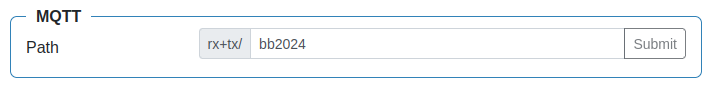                     | MQTT          | For lightweight IoT device communication.                                                                  |
| 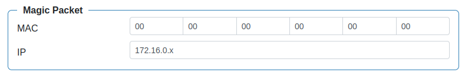     | Magic Packet  | To wake up devices on your network.                                                                        |
| 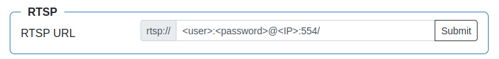                     | RTSP          | For streaming video from cameras.                                                                          |
| 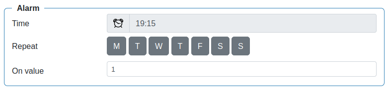                   | Alarm         | For time-based automation.                                                                                 |

## Extending the Smart Home

The Smart Home platform is designed to be modular and extensible. You can add new tiles, items, and protocols to support new devices and functionalities.

### Adding a New Tile

Here is a quick-start for adding new tiles. For more implementation details look into the code of already existing ones.

1.  **Create the Tile Class (`config/tiles/my_tile.py`):**

    ```python
    from flask_babel import gettext
    from config.tiles.default import Tile

    class MyTile(Tile):
        TYPE = "my_tile"
        VISIBLE = True
        NAME = gettext("My Tile")
        PROTOCOLS_ABLE = ["mqtt"]
        VALUE = "Initial Value"

        @property
        def config(self):
            return { self._ICON: "default_icon.png" }

        @property
        def edit_config(self):
            from config.items.icon_picker import IconPicker
            return { self._ICON: IconPicker().make_object(value=self.config[self._ICON], label=gettext("Tile Icon")) }
    ```

2.  **Create the HTML Template (`templates/tiles/my_tile.html`):**

    ```html
    <div class="tile" data-id="{{ id }}" data-type="{{ type }}">
        <div class="name">{{ config.name }}</div>
        <div class="value">{{ value }}</div>
    </div>
    ```

3.  **Create the JavaScript File (`static/js/tiles/my_tile.js`):**

    ```javascript
    function my_tile(tile) {
        // This function is called when the tile is loaded or updated.
        // 'tile' is a jQuery object representing the tile's div.
        console.log("MyTile loaded:", tile.data("id"));
    }
    ```

4.  **Register the Tile (`config/tiles/general.py`):**

    ```python
    from config.tiles.my_tile import MyTile
    # ... other imports

    class Tiles:
        INSTANCES = [
            MyTile(),
            # ... other tiles
        ]
        # ...
    ```

### Adding a New Item

Here is a quick-start for adding new items. For more implementation details look into the code of already existing ones.

1.  **Create the Item Class (`config/items/my_item.py`):**

    ```python
    from flask_babel import gettext
    from config.items.default import Item

    class MyItem(Item):
        TYPE = "my_item"
        VISIBLE = True
        NAME = gettext("My Item")
        PROTOCOLS_ABLE = ["mqtt"]
        VALUE = "Initial Item Value"

        @property
        def config(self):
            return { self._LABEL: self.NAME }

        @property
        def edit_config(self):
            from config.items.input import Input
            return { self._LABEL: Input().make_object(value=self.config[self._LABEL], label=gettext("Label")) }
    ```

2.  **Create the HTML Template (`templates/items/my_item.html`):**

    ```html
    <div class="item" data-id="{{ id }}" data-type="{{ type }}">
        <div class="label">{{ config.label }}</div>
        <div class="value">{{ value }}</div>
    </div>
    ```

3.  **Create the JavaScript File (`static/js/items/my_item.js`):**

    ```javascript
    function my_item(item) {
        // This function is called when the item is loaded or updated.
        // 'item' is a jQuery object representing the item's div.
        console.log("MyItem loaded:", item.data("id"));
    }
    ```

4.  **Register the Item (`config/items/general.py`):**

    ```python
    from config.items.my_item import MyItem
    # ... other imports

    class Items:
        INSTANCES = [
            MyItem(),
            # ... other items
        ]
        # ...
    ```

### Adding a New Protocol

Here is a quick-start for adding new protocols. For more implementation details look into the code of already existing ones.

1.  **Create the Protocol Class (`config/protocols/my_protocol.py`):**

    ```python
    from config.protocols.default import Protocol
    from flask_babel import gettext

    class MyProtocol(Protocol):
        TYPE = "my_protocol"
        VISIBLE = True
        NAME = gettext("My Protocol")

        def __init__(self, terminal, update):
            super().__init__(terminal, update)

        def config(self):
            return { "host": "localhost" }

        def edit_config(self):
            from config.items.input import Input
            return { "host": Input().make_object(value=self.config()["host"], label=gettext("Host")) }

        def publish(self, config, value):
            self._terminal.protocol(self.TYPE, f"Publishing '{value}' to {config['host']}")

        def add_listener_inner(self, config):
            self._terminal.protocol(self.TYPE, f"Listening on {config['host']}")
    ```

2.  **Register the Protocol (`config/protocols/general.py`):**

    ```python
    from config.protocols.my_protocol import MyProtocol
    # ... other imports

    class Protocols:
        def __init__(self, terminal, updater, fmng, tmng_r):
            # ...
            self.__instances = [
                MyProtocol(terminal, self),
                # ... other protocols
            ]
            # ...
    ```

## User Interface

### Login and Registration

<table>
  <tr>
    <td align="center">
      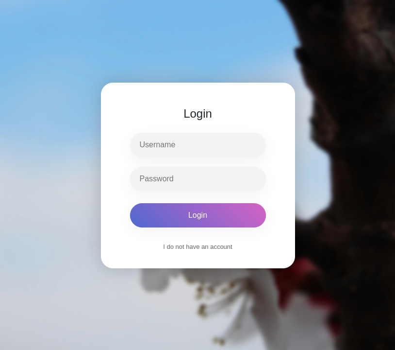
      <br>
      <sub><b>Login</b></sub>
    </td>
    <td align="center">
      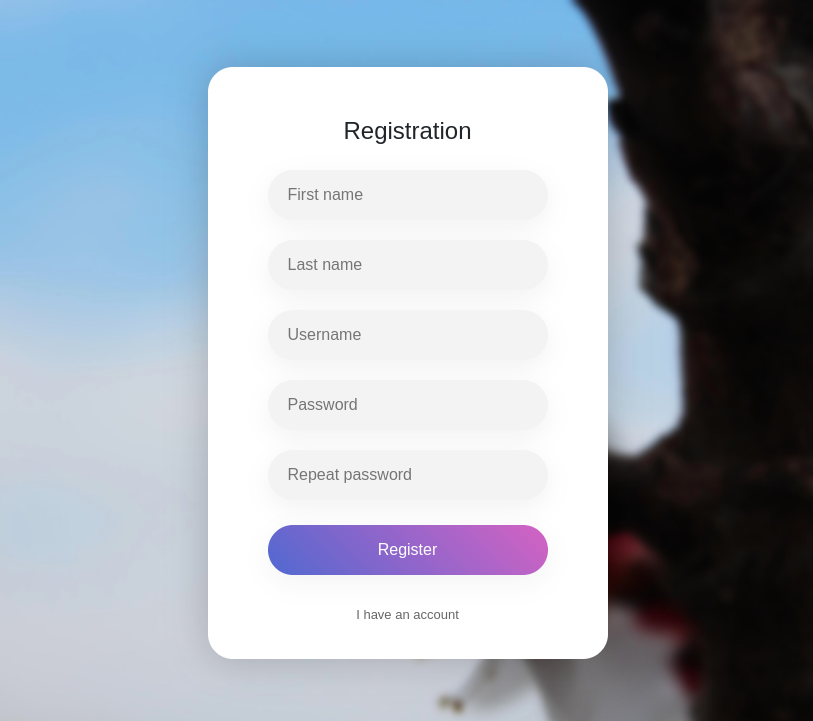
      <br>
      <sub><b>Register</b></sub>
    </td>
  </tr>
</table>

### Main Dashboard

The main dashboard consists of "Slides" which are pages that can be swiped through. Each slide contains "Tiles" which represent devices.


<table>
  <tr>
    <td align="center">
      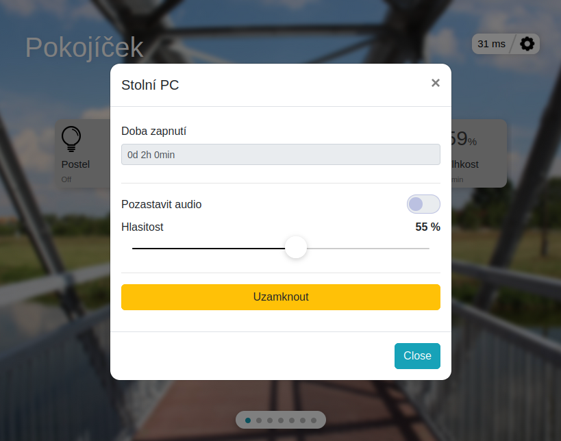
      <br>
      <sub><b>Modal (Light)</b></sub>
    </td>
    <td align="center">
      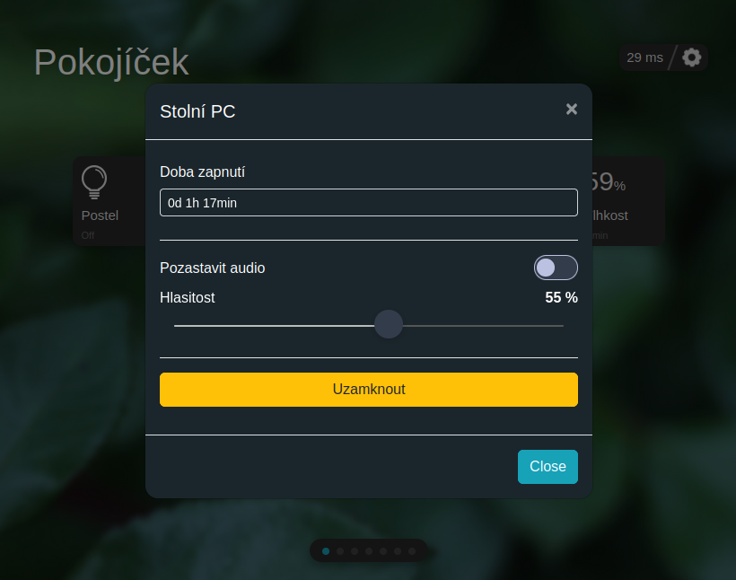
      <br>
      <sub><b>Modal (Dark)</b></sub>
    </td>
  </tr>
</table>

### Edit Mode

The edit mode allows you to add, remove, and reorder slides and tiles.

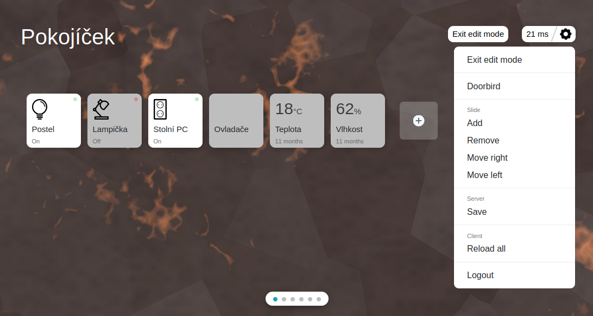

### Modals

Long-pressing a tile opens a modal with more detailed information and controls, which are called "Items".

<table>
  <tr>
    <td align="center">
      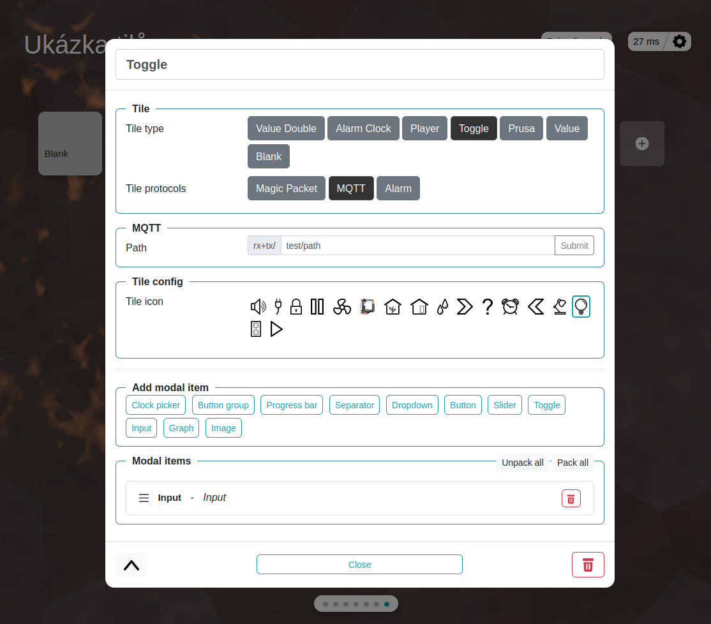
      <br>
      <sub><b>Modal Edit (Light)</b></sub>
    </td>
    <td align="center">
      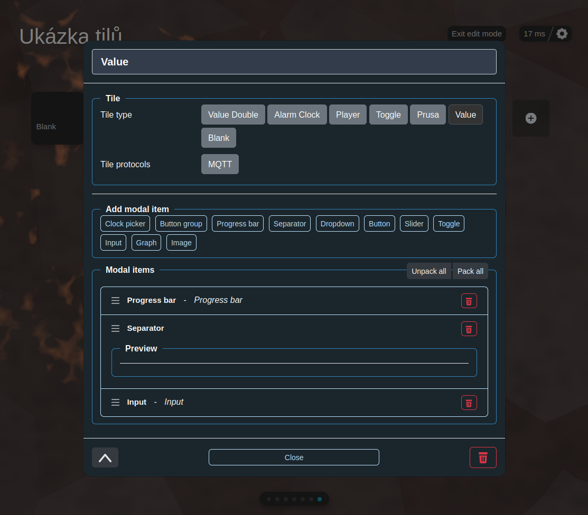
      <br>
      <sub><b>Modal Edit (Dark)</b></sub>
    </td>
  </tr>
</table>

### Settings

The settings modal allows you to customize the theme, background, and other user-specific settings.

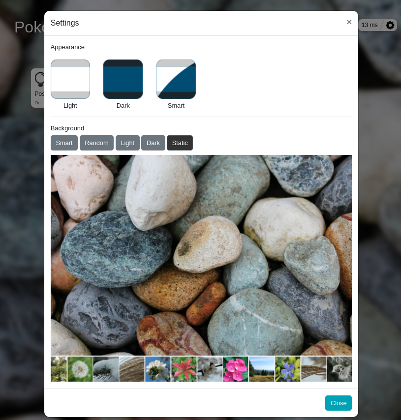

### User and Client Lists

The application provides lists of registered users and active clients.

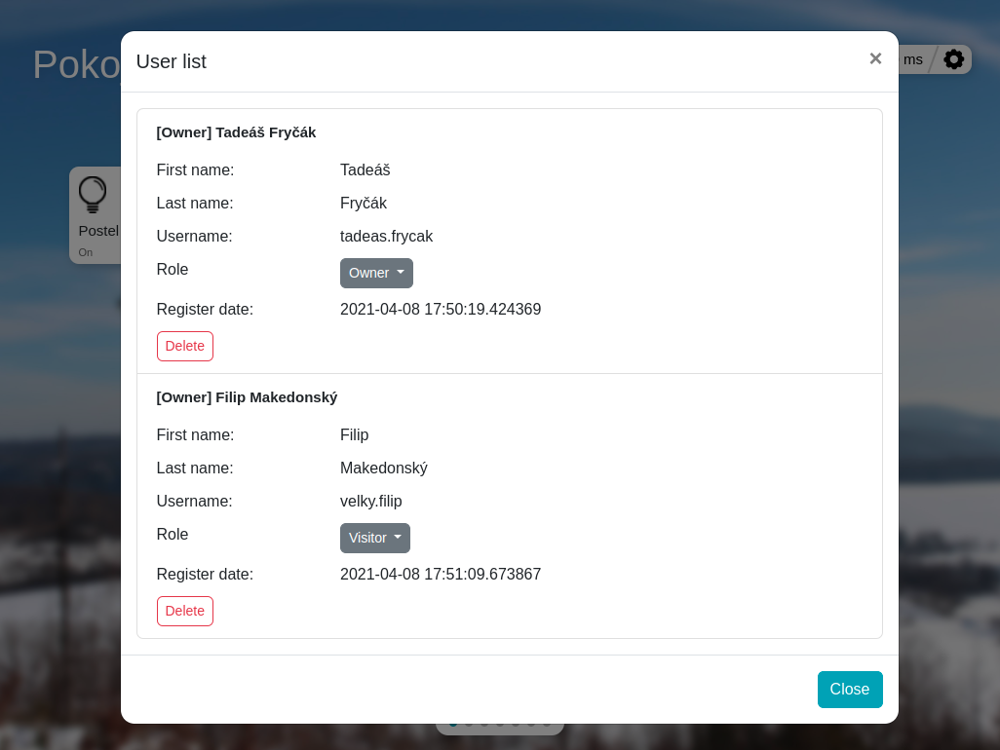
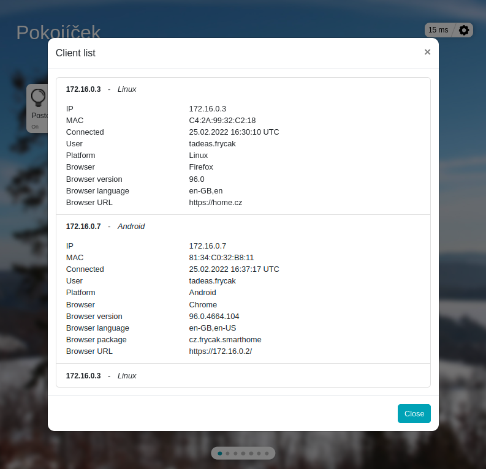

## Integrations

### Hikvision Camera System

The application can integrate with Hikvision cameras for live streaming and motion detection.

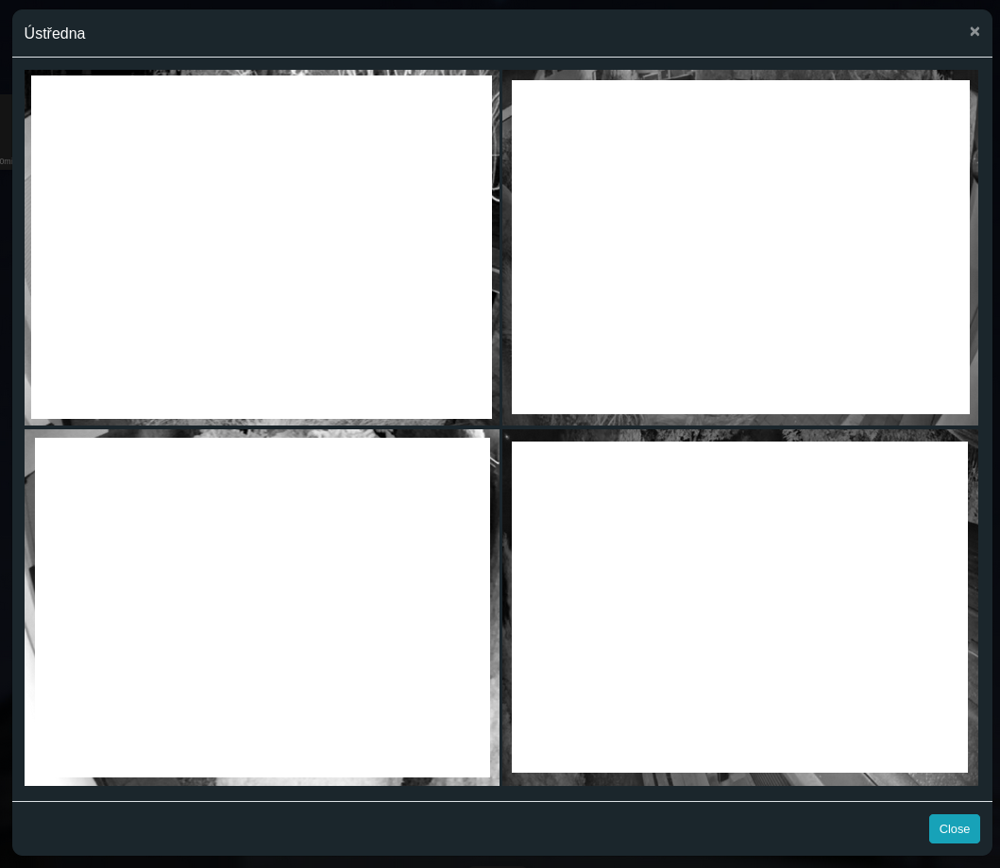

### Doorbird Video Doorbell

The application can integrate with Doorbird video doorbells for live view, opening doors, and motion detection.

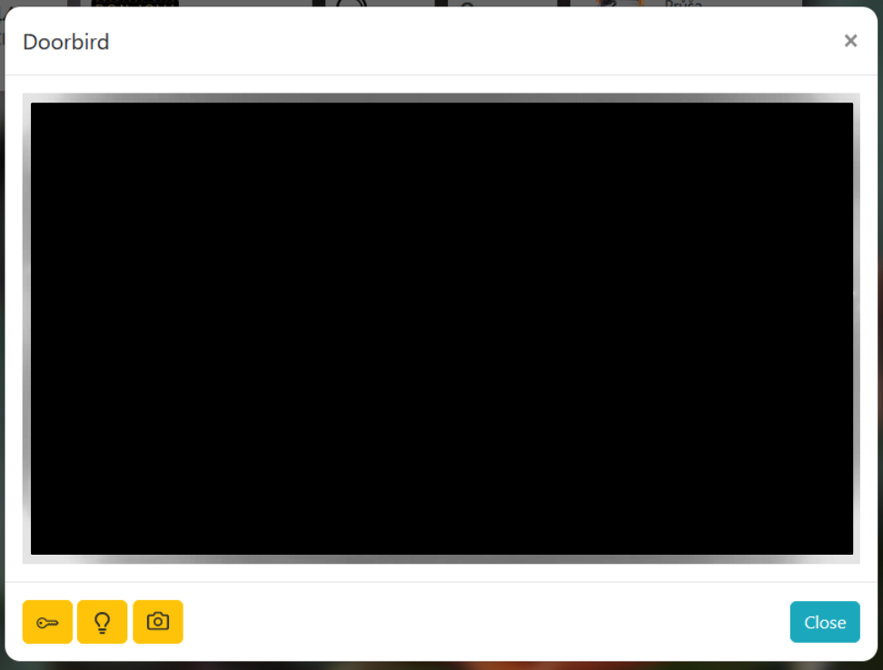

## Contributors

- Tadeáš Fryčák - [Web](https://www.frycak.com/), [LinkedIN](https://www.linkedin.com/in/tade%C3%A1%C5%A1-fry%C4%8D%C3%A1k/)  
- Filip Szkandera - [Twitter](https://x.com/ten_filip/), [LinkedIN](https://www.linkedin.com/in/filip-szkandera-074154211/)

## Contributing

Contributions are welcome! Please feel free to submit a pull request or open an issue.

## License

The authors' code is licensed under the MIT License.
